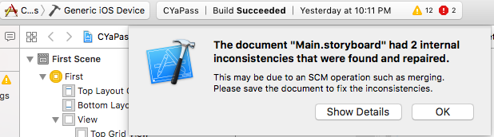

# Xcode

* ### 要Build App到手機發生 `iPhone6 is busy: Processing symbol files`

  * 拔掉手機重新插入
  * 重新啟動Xcode
  * 確認AppID有沒有登入到Xcode上
  * 看此台裝置是否有加入到AppID下
  * 等待Processing symbol完畢
* ### 產生這個警告訊息然後按Button又都沒反應的解決方式

  * 先強制關閉xcode
  * 用別的編輯器打開Main.storyboard
  * 然後搜尋height，把破萬的異常值都改成千位數以內
  * 存檔後離開Main.stroyboard
  * 再重新啟動這個專案
* ### 要在IB內解除stackview的方法

  * 先選擇想解散的stackview
  * 按下option鍵，點選`Embed In Stack`按鈕
  * 選擇`unembed`即可
* ### 遇到`apple mach o linker error`

  * 到`Project Navigator->Target->Build Phases->Link Binary With Libraries`新增`libsqlite3.tbd`

* ### 遇到 `Couldn’t communicate with a helper application` 的解法

  ```
  xcrun git config --global user.email you@yourdomain.com
  xcrun git config --global user.name "Your Name Here"
  ```
* ### 遇到`Could not build Objectiovmee-C module 'some module'`的解決方法

 * Clean the project, including the build cache (Command-Option-Shift-K)
 * Removing the pod.lock file and the pods.xcodeproj files
 * And then closing Xcode and running pod update again
 * Then building again.


* ### 新增字型
 * 先將字型新增到專案內
 * 在plist內新增`"Fonts provided by application"`的`Array`，Item設定`String`類別，Value填入字型的名稱

